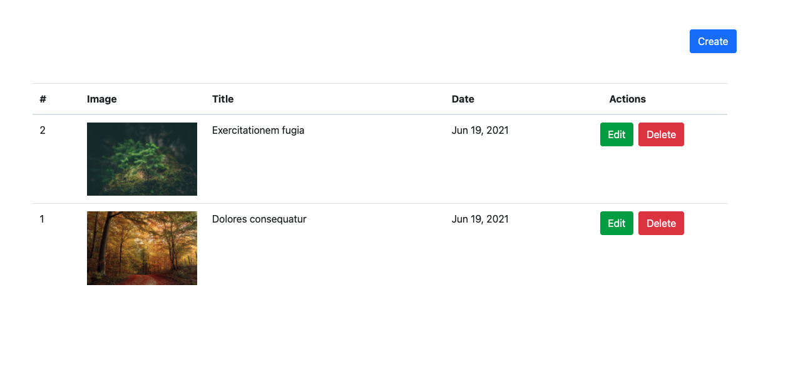
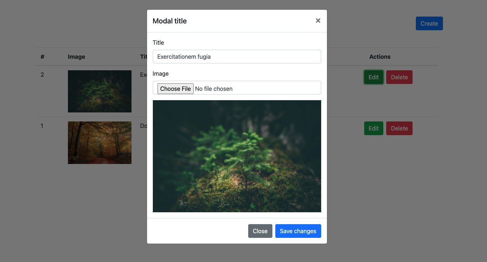
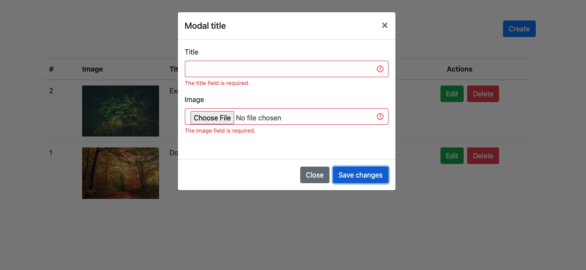

# Laravel SPA(Single Page Application) with JQuery

A demo SPA application using JQuery and Bootstrap 4

## Preview List



## Preview Edit



## Preview Validation Message



## Installation

Clone the repo locally:

```sh
git clone -b spa_jquery https://github.com/thetminnhtun/laravel-project-sample.git laravel-project-sample
cd laravel-project-sample
```

Install PHP dependencies:

```sh
composer install
```

Setup configuration:

```sh
cp .env.example .env
```

Generate application key:

```sh
php artisan key:generate
```

Create an SQLite database. You can also use another database (MySQL, Postgres), simply update your configuration accordingly.

```sh
touch database/database.sqlite
```

Run database migrations:

```sh
php artisan migrate
```

To create the symbolic link, you may use the `storage:link` Artisan command:

```sh
php artisan storage:link
```

Run the dev server (the output will give the address):

```sh
php artisan serve
```
